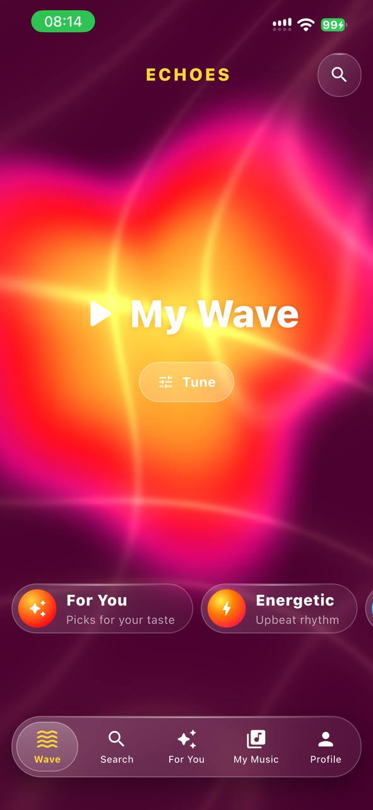
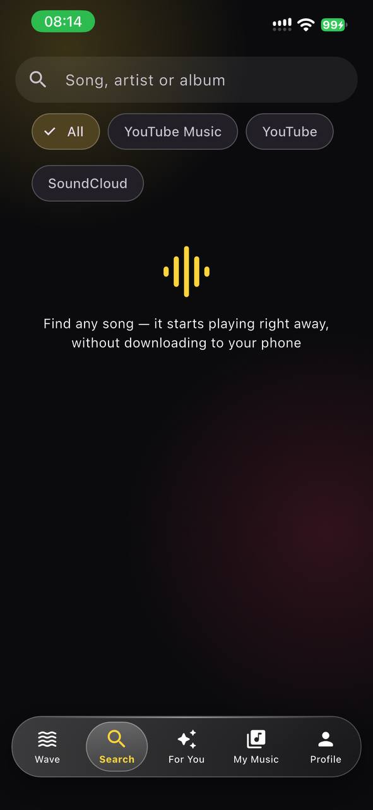
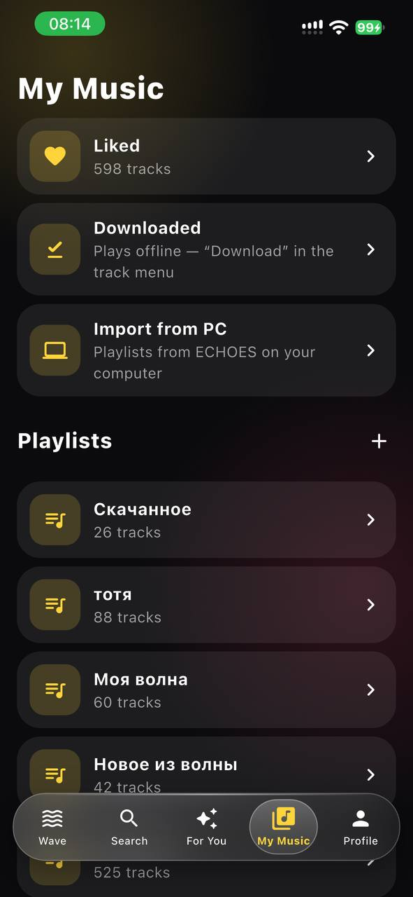
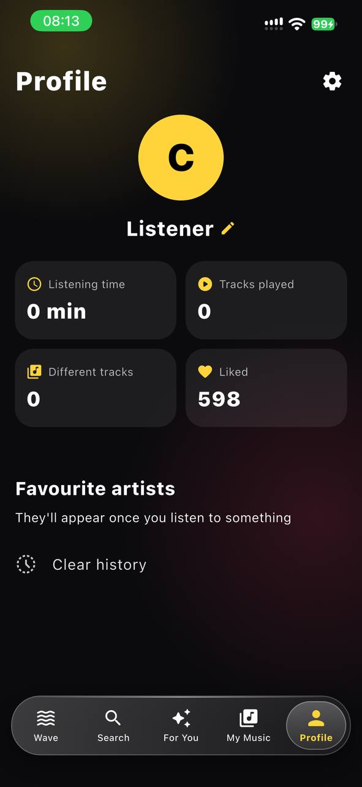
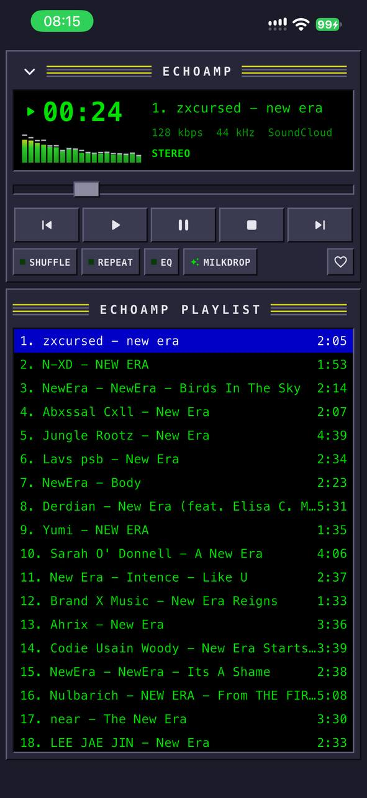
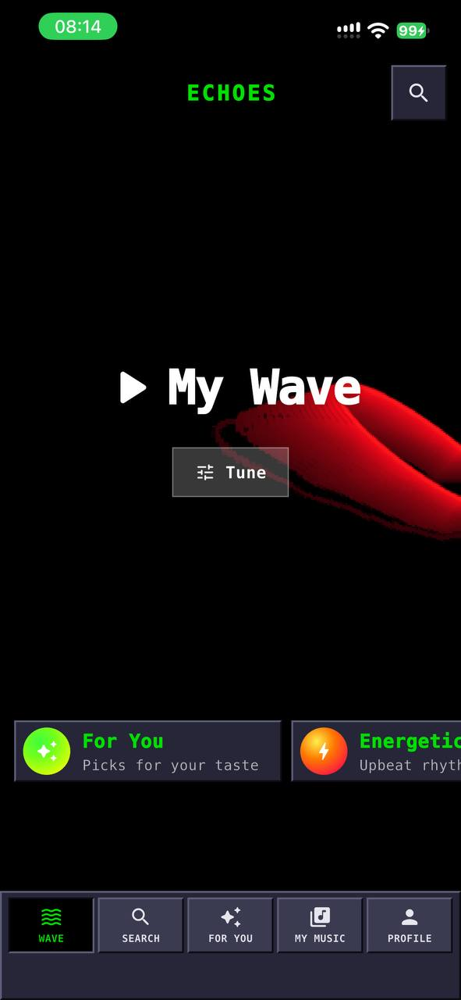
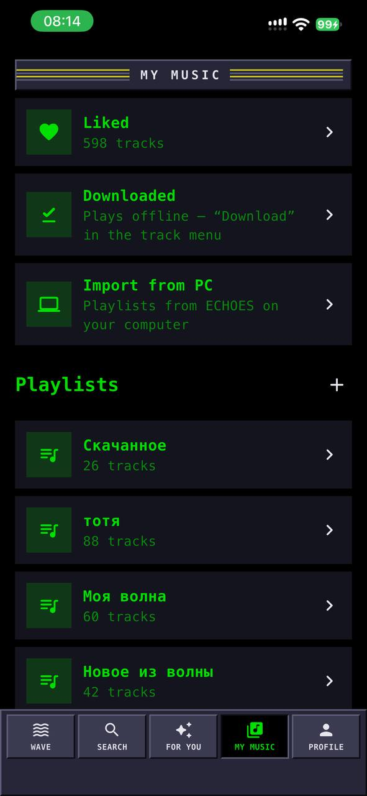
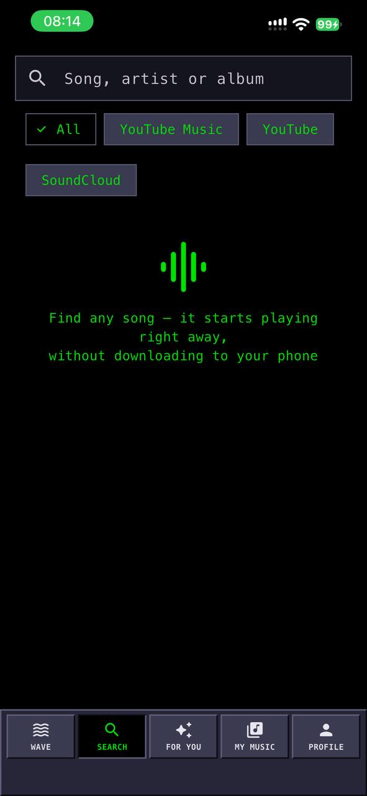
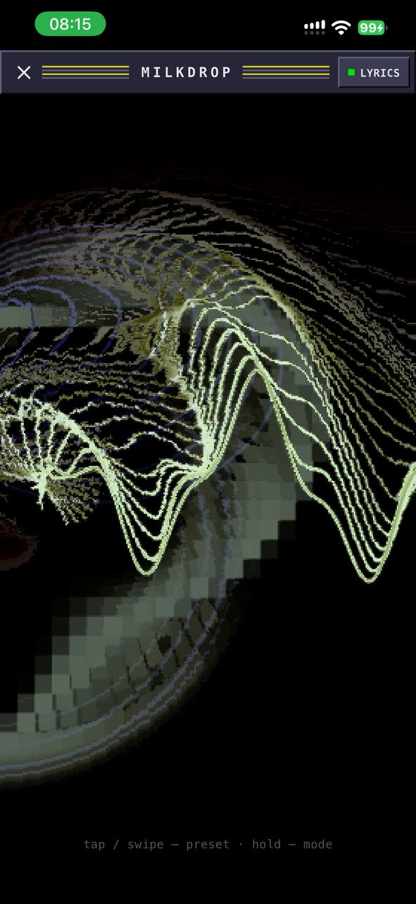
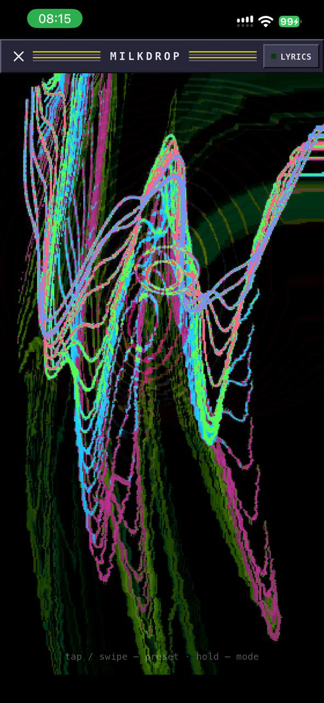

# ECHOES mobile

Музыкальный плеер для iPhone и iPad в стиле ECHOES. Найдите любую песню, и она сразу заиграет потоком.
Нужные треки можно скачать внутрь приложения и слушать без интернета. Компьютер и свой сервер не нужны:
поиск и звук берутся с YouTube Music, YouTube и SoundCloud прямо на телефоне.

Интерфейс на русском и английском (*English below*).

<p align="center">
  
  
  
  
</p>

<p align="center">
  
  
  
  
</p>

<p align="center">
  
  
</p>

## Что умеет

**Слушать**
- **Моя волна** — бесконечный поток треков по вашим лайкам и истории или по настроению: «Энергичное»,
  «Спокойное», «Грустное», «Тренировка», «Для сна», «Русский рэп». Живое облако на фоне рисуется на
  видеокарте и окрашивается под настроение.
- **Для вас** — подборки «Похоже на …», «Ещё от …» и популярное.
- **Поиск сразу по YouTube Music, YouTube и SoundCloud** (или по одному из них). Замедленные и ускоренные
  версии (slowed / sped up) и перезаливы отсеиваются, оригинал оказывается сверху.
- **Страница исполнителя**: аватар, слушатели в месяц (по данным Spotify), подписчики SoundCloud,
  популярное, альбомы, синглы и EP, все треки.
- Альбомы в поиске и у исполнителей: «Слушать» и «Вперемешку».

**Очередь и управление**
- Свайп по треку **вправо — в очередь**, **влево — в плейлист**, как в Spotify.
- Очередь как в Spotify: «Играть следующим», «В конец очереди», перетаскивание и удаление.
- Перемешивание действительно перемешивает очередь, а при выключении возвращает прежний порядок.
- Фоновое воспроизведение, экран блокировки, пункт управления, AirPods.
- Мини-плеер виден на всех экранах.

**Текст песни**
- Синхронный текст, который подсвечивается по строкам (lrclib.net, lyrics.ovh). Есть умный поиск
  с учётом транслитерации, «feat.» и пометок в названии.
- Если текст не нашёлся: поиск вручную, свой текст, синхронизация нажатиями или автоматически.
  Сдвиг текста раньше или позже на 0,5 с.
- **Режим винила**: вместо обложки крутится пластинка, а под ней идут строки текста.

**Звук**
- **Эквалайзер** на 10 полос и 12 пресетов: «Бас+», «Рок», «Вокал», «Ночной» и другие.
- Экономия трафика: лёгкий аудиопоток, если YouTube его отдаёт.
- Если трек не играет из одного источника, та же песня берётся из другого автоматически.

**Своя музыка**
- «Мне нравится», плейлисты, история.
- Поиск внутри плейлиста, сортировка (как добавлены, сначала новые, по названию, исполнителю или
  длительности), вид списком или сеткой.
- **Скачивание в приложение**: трек или весь плейлист сохраняется в память приложения и играет без интернета.
- **Перенос плейлистов с ПК**: в ECHOES на компьютере «Перенести все плейлисты на телефон…», дальше
  «Моя музыка» → «Импорт с ПК». Понимает также `.m3u` и `.txt`.
- **Профиль**: время с музыкой, число прослушанных треков, любимые исполнители.

**Оформление**
- **Обычная тема** в стиле Liquid Glass: стекло, размытая обложка на фоне, обложки в высоком качестве без полос.
  Можно выбрать цвет акцента, светлую тему или своё фото на фон из галереи.
- **Эховамп** — весь интерфейс как Winamp 2 на ПК: ЖК-дисплей, спектр, плейлист, кнопки с фаской.
- **MilkDrop** в Эховампе: 135 пресетов с волнами и обратной связью, как в ECHOES на ПК. По кнопке «ТЕКСТ»
  поверх визуализации в такт вылетают слова песни. Тап или свайп меняет пресет, удержание — режим.
- Язык: авто (как на iPhone), русский или English.
- Подстраивается под любой iPhone и iPad, в портрете и при повороте.

> **Ограничения.** iOS не отдаёт приложениям сам звук, поэтому спектр и MilkDrop двигаются под
> синтезированный ритм трека, а не под настоящий сигнал. Часть треков SoundCloud приходит потоком HLS:
> они играют без эквалайзера.

## Установка

Это неофициальный клиент, в App Store его не пропустят, поэтому приложение ставится вручную.

1. Откройте вкладку **[Actions](../../actions)**, выберите последнюю успешную сборку «Build IPA» и внизу
   в **Artifacts** скачайте **ECHOES-ipa**. Внутри zip лежит `ECHOES.ipa`.
2. Поставьте IPA через **[AltStore](https://altstore.io)** или **[Sideloadly](https://sideloadly.io)**
   со своим Apple ID.
3. На iPhone: Настройки → Основные → VPN и управление устройством → ваш Apple ID → **Доверять**.
   На iOS 16+ включите ещё Настройки → Конфиденциальность и безопасность → **Режим разработчика**.

С бесплатным Apple ID приложение работает 7 дней. Потом AltStore переподписывает его сам по Wi-Fi,
пока на ПК запущен AltServer. Иногда YouTube что-то меняет, и тогда приложение нужно пересобрать
со свежей версией `youtube_explode_dart`.

Сборка идёт в облаке GitHub (macOS), Mac не нужен. Каждый push в `main` запускает её сам, вручную —
Actions → Build IPA → **Run workflow**.

## Для разработки

```
flutter pub get
flutter analyze
flutter test                      # вёрстка на 6 размерах экрана × 2 размера шрифта, очередь, свайпы, эквалайзер
dart run tool/check_stream.dart "Linkin Park Numb"   # поиск, поток и текст — без телефона
flutter test test/screenshots_test.dart --run-skipped --update-goldens   # снимки экранов → test/goldens
```

Платформенные папки (`ios/`) не хранятся в репозитории, сборка создаёт их сама (`flutter create`).
Эквалайзер — свой нативный плагин в `packages/echoes_eq` (MTAudioProcessingTap).

## Поддержать проект

Если приложение вам нравится, можно поддержать разработку:

- ☕ **Buy Me a Coffee** — https://buymeacoffee.com/blesstilean
- 🇺🇦 **Банка monobank** (для Украины) — https://send.monobank.ua/jar/4q4PTVtKMb
## Авторы

- [padr0chill](https://github.com/padr0chill)
- [Rop1ms](https://github.com/rop1ms)

---

## English

ECHOES mobile is a music player for iPhone and iPad. Search any song and it streams right away from
YouTube Music, YouTube or SoundCloud. You can also download tracks inside the app for offline listening.

- **My Wave**: an endless stream based on your likes and history, or a mood. **For You** picks.
  Combined search that filters out slowed or sped-up re-uploads. Artist pages with Spotify monthly
  listeners, albums and all tracks.
- Spotify-style queue and swipes: right adds to queue, left adds to playlist. Background playback and lock screen controls.
- Synced lyrics with smart search, manual sync and timing shift. Vinyl mode.
- 10-band **equalizer** with 12 presets.
- Liked songs, playlists with search, sorting and grid view, offline downloads, playlist import from ECHOES on PC.
- Liquid Glass theme with a custom background. **Echoamp**, a full Winamp 2 skin with **MilkDrop**
  (135 presets, song lyrics flying over the visuals).
- Russian and English UI.

Support the project: [Buy Me a Coffee](https://buymeacoffee.com/blesstilean) · [monobank jar (Ukraine)](https://send.monobank.ua/jar/4q4PTVtKMb)

Install: download **ECHOES-ipa** from the latest successful run in [Actions](../../actions) and sideload
it with AltStore or Sideloadly.
